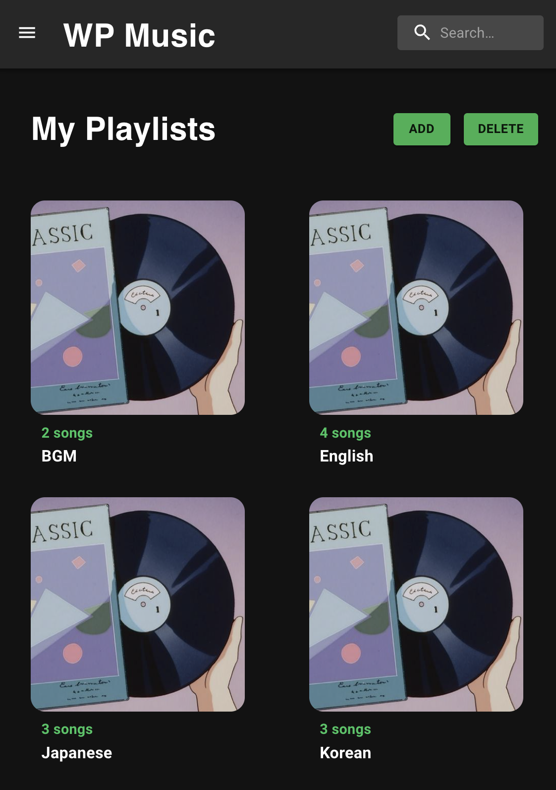
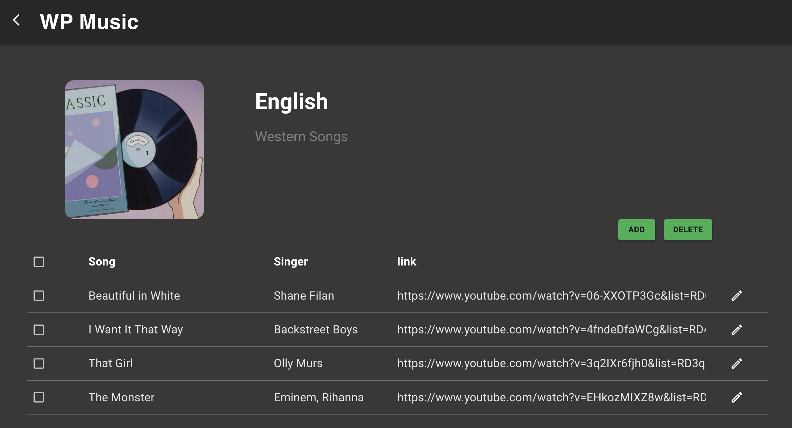

# My Playlist - Music Management Web App

A full-stack web application for creating and managing music playlists. Built with **React**, **TypeScript**, **Node.js**, **Express**, and **MongoDB**.


### Home Page


### Playlist Page  



## Features

**Playlist Management** - Create, edit, and delete playlists with real-time updates  
**Song Management** - Add, edit, and delete songs; move songs between playlists  
**Responsive Design** - Works seamlessly on desktop, tablet, and mobile  
**Input Validation** - Duplicate name detection and user-friendly error messages  
**Selection Features** - Checkboxes with "select all" functionality


## Tech Stack

**Frontend:** React 18, TypeScript, Vite, Axios, Tailwind CSS  
**Backend:** Node.js, Express, MongoDB, Mongoose


## Quick Start

### Prerequisites

- Node.js v18.17.1 (or compatible version)
- MongoDB account (MongoDB Atlas recommended)

### Installation & Setup

1. **Clone and install dependencies**
```bash
git clone <repository-url>
cd my_playlist

cd frontend
yarn
cd ..

cd backend
yarn
cd ..
```

2. **Configure environment variables**
   
Backend: `backend/.env`

```bash
PORT=8000
MONGO_URL="mongodb+srv://<username>:<password>@<cluster>.mongodb.net/?retryWrites=true&w=majority"
```

Frontend: `frontend/.env`

```bash
VITE_API_URL="http://localhost:8000/api"
```

3. **Start the servers**
```bash
# Terminal 1: Backend
cd backend
yarn dev

# Terminal 2: Frontend
cd frontend
yarn dev
```

4. **Open your browser**
Navigate to `http://localhost:5173`

**Note:** 
Clear your MongoDB before first run to avoid schema conflicts. 
Log into MongoDB Atlas, navigate to Collections, and delete any existing data.


## Project Structure

```
frontend/
├── src/
│   ├── components/          # React UI components
│   ├── hooks/useSongs.tsx   # Global state management
│   ├── utils/
│   │   ├── client.ts        # API client
│   │   └── env.ts           # Environment config
│   └── App.tsx              # Main component

backend/
├── src/
│   ├── routes/              # API endpoints
│   ├── models/              # MongoDB schemas
│   └── index.ts             # Server entry point
└── .env                     # Configuration
```


## API Endpoints

### Playlists
| Method | Endpoint | Description |
|--------|----------|-------------|
| GET | `/api/playlists` | Get all playlists |
| POST | `/api/playlists` | Create new playlist |
| PUT | `/api/playlists/:id` | Update playlist details |
| DELETE | `/api/playlists/:id` | Delete playlist |

### Songs
| Method | Endpoint | Description |
|--------|----------|-------------|
| GET | `/api/songs` | Get all songs |
| POST | `/api/songs` | Create new song |
| PUT | `/api/songs/:id` | Update song details |
| DELETE | `/api/songs/:id` | Delete song |


## Usage

**Home Page**
- View all playlists in a responsive grid
- Click ADD to create a new playlist
- Click DELETE to enter delete mode and remove playlists

**Playlist Page**
- Click on playlist title/description to edit (auto-saves)
- Click ADD to add songs to the playlist
- Click on song EDIT to modify song details or add to other playlists
- Select songs with checkboxes and click DELETE to remove them


## Key Features Implemented

- Playlist and song CRUD operations  
- Real-time editing of playlist metadata  
- Cross-playlist song management  
- Input validation with duplicate name detection  
- Responsive grid layout  
- Checkbox selection with "select all"  
- User-friendly error messages


## Troubleshooting

**MongoDB Connection Error**
- Verify `MONGO_URL` in `backend/.env` (check for extra semicolons)
- Clear existing MongoDB collections before first run
- Try switching Node.js to v18.17.1

**Frontend Can't Connect to Backend**
- Confirm `VITE_API_URL` matches your backend port
- Ensure backend is running on the configured PORT


## License

MIT License - Feel free to use this project for learning and educational purposes.
